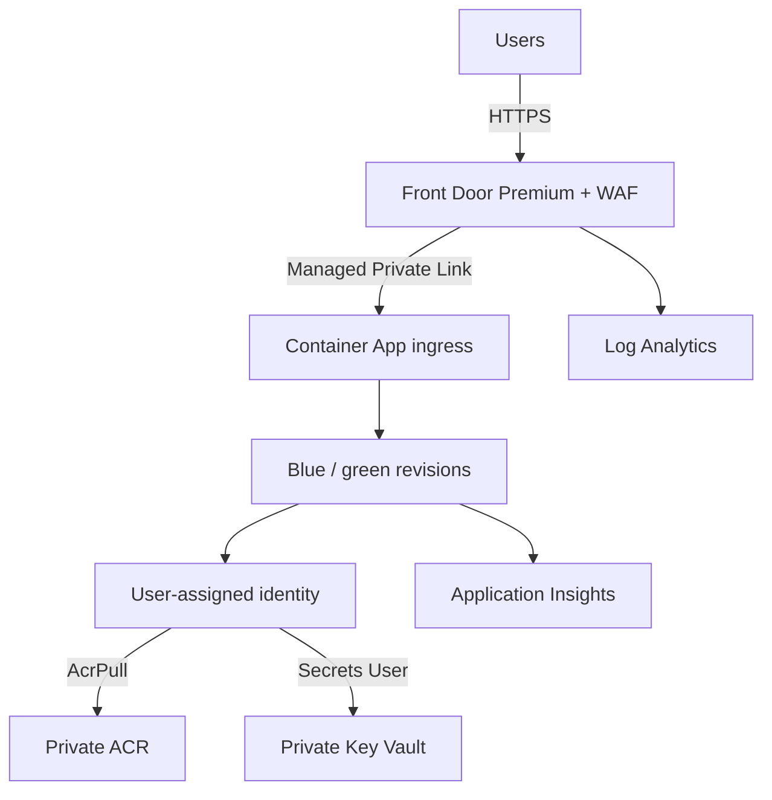

# Secure Next.js on Azure Container Apps

This starter provisions a production-oriented Next.js platform with Azure Front Door Premium, WAF, Private Link, Azure Container Apps native blue/green revisions, private ACR and Key Vault endpoints, managed identity, and centralized telemetry.

## Recommended architecture



The Container App ingress is `external` from the app's point of view, but the Container Apps environment has public network access disabled. Therefore, the app can be reached through Front Door's managed Private Link—not directly from the internet.

## Components you need

| Component | Purpose | Production decision in this starter |
|---|---|---|
| Resource group and naming/tags | Ownership and cost allocation | One workload resource group |
| VNet | Private service connectivity and deployment runners | Separate ACA and private-endpoint subnets |
| Container Apps environment | Regional serverless runtime | Workload profiles environment, internal, zone redundant |
| Container App | Runs the Next.js standalone server | Multiple revisions; minimum 2 replicas |
| Azure Front Door Premium | Global TLS endpoint and origin routing | HTTPS-only, managed Private Link to ACA |
| WAF policy | OWASP/bot protection and rate limiting | Prevention mode; managed rules plus baseline rate limit |
| ACR Premium | Private image repository | Admin disabled, Private Endpoint, managed identity pull |
| User-assigned managed identity | Passwordless Azure resource access | `AcrPull` and `Key Vault Secrets User` only |
| Key Vault | Application secrets/certificates | RBAC, purge protection, Private Endpoint |
| Log Analytics | Platform, ingress, WAF, and queryable logs | 30-day starter retention |
| Application Insights | App traces, failures, dependencies | Workspace based; instrument Next.js with OpenTelemetry |
| Private DNS zones | Resolve ACR, Key Vault, and ACA privately | Linked to workload VNet |
| CI/CD identity and private runner | Build, deploy, test, and promote revisions | GitHub OIDC; ephemeral/self-hosted runner in VNet |
| Remote Terraform state | Safe team changes and locking | Azure Storage backend example included |

Add a database, cache, or storage account only if the app needs it. Give each a Private Endpoint, private DNS zone, managed-identity authentication where supported, diagnostic settings, backup, and restore testing. Do not put a database connection string in Terraform variables or GitHub secrets if workload identity is available.

## Blue/green release model

1. Production currently sends 100% to the revision labeled `blue` (or `green`).
2. The pipeline builds an immutable image using the full Git SHA and pushes it to ACR.
3. `deploy-blue-green.sh` creates a new Container Apps revision and assigns the unused color label to it.
4. Production stays at 100/0 while the private runner tests the label-specific FQDN.
5. The script either switches 100% at once or starts a canary split such as 90/10.
6. Promotion moves traffic to 100/0. Rollback reverses the two weights without rebuilding an image.

Front Door always targets the stable app FQDN. Container Apps performs the revision routing, so Front Door and DNS do not change during a release.

## Implementation plan

### Phase 1 — application readiness

- Configure Next.js `output: "standalone"` and use the supplied multi-stage Dockerfile.
- Add shallow `/api/health/live` and `/api/health/ready` route handlers. Readiness checks must be fast and should not depend on optional downstream systems.
- Add OpenTelemetry/Application Insights instrumentation and structured JSON logs.
- Confirm the app honors forwarded host/protocol headers and does not generate redirects to the ACA hostname.

Copy `app-examples/Dockerfile` and `app-examples/next.config.mjs` into the application root (merge the Next.js config if one already exists). Copy the two health examples to the paths shown in their comments. The starter standardizes the container on port `8080`; Next.js reads this from `PORT`.

### Phase 2 — Terraform foundation

1. Create an Azure Storage account/container for remote Terraform state. Grant the deployment identity `Storage Blob Data Contributor`; do not use storage keys.
2. Copy `terraform/backend.tf.example` to `terraform/backend.tf` and change its values.
3. Copy `terraform/terraform.tfvars.example` to `terraform/terraform.tfvars` and change the subscription, names, region, CIDRs, tags, and scaling.
4. Initialize, review, and apply:

   ```bash
   cd terraform
   terraform init
   terraform fmt -check -recursive
   terraform validate
   terraform plan -out tfplan
   terraform apply tfplan
   ```

5. Approve the Front Door-managed Private Link request. AzureRM currently creates the request but the service still requires explicit origin-side approval:

   ```bash
   ../scripts/approve-frontdoor-private-link.sh \
     "$(terraform output -raw resource_group_name)" \
     "$(terraform output -raw container_apps_environment_name)"
   ```

6. Wait for Front Door propagation, then test `https://$(terraform output -raw frontdoor_hostname)`.
7. Verify direct access to `container_app_private_fqdn` fails from the public internet.

The initial bootstrap image uses `/` for probes so the first apply can succeed. After copying the supplied Next.js health routes, set these values in `terraform.tfvars` and apply again:

```hcl
liveness_probe_path  = "/api/health/live"
readiness_probe_path = "/api/health/ready"
```

### Phase 3 — CI/CD and releases

- Create separate federated identities for Terraform and application deployment. Avoid a client secret.
- Run the supplied workflow on a private, preferably ephemeral, Azure runner attached to the VNet. This is required because ACR and the label-specific ACA endpoints are private.
- Configure the protected GitHub `production` environment and the four repository variables shown in the workflow.
- Grant the release identity only the control-plane rights needed to update this Container App and data-plane rights to push to the required ACR repository. Tighten broad built-in roles with a custom role after validating the exact operations.
- Require review for production and do not allow concurrent production deployments.

Manual release example:

```bash
export RESOURCE_GROUP="rg-nextweb-prod"
export CONTAINER_APP="ca-nextweb-prod"
export CONTAINER_APP_ENVIRONMENT="cae-nextweb-prod"
export IMAGE="<acr>.azurecr.io/nextjs:<full-git-sha>"
export RELEASE_ID="$(git rev-parse --short=12 HEAD)"
export SMOKE_PATH="/api/health/ready"
export CANARY_PERCENT=0
./scripts/deploy-blue-green.sh
```

For a canary, set `CANARY_PERCENT=10`, observe error rate, latency, and saturation, then run the printed `promote.sh` command. The release script prints the exact rollback command after promotion.

### Phase 4 — custom domain and operations

- Add a Front Door custom domain, create the required DNS validation record, enable managed TLS, associate the route and WAF policy, then disable the default `azurefd.net` endpoint if your policy requires it.
- Set Front Door caching only for hashed static assets such as `/_next/static/*`. Do not cache SSR, authenticated, API, or personalized responses without explicit cache-key rules.
- Tune WAF in Detection mode in nonproduction, investigate false positives, then keep production in Prevention mode. The included rate limit is only a starting value.
- Create alerts for Front Door origin health, WAF blocks, ACA replica restarts, HTTP 5xx rate, p95 latency, exceptions, and log-ingestion failure. Route alerts to an Azure Monitor action group/Datadog/PagerDuty according to your support model.
- Test rollback, secret rotation, restore, regional recovery, and certificate renewal—not just initial deployment.

## Security checks before production

- [ ] Front Door is the only public ingress and the ACA environment public network access is disabled.
- [ ] TLS redirect, managed certificate, HSTS, CSP, frame, content-type, and referrer headers are configured and tested.
- [ ] ACR admin credentials are disabled; images are scanned, signed where required, and deployed by immutable digest/tag.
- [ ] No secret values appear in Terraform state, workflow YAML, logs, or container environment literals.
- [ ] Managed identities have resource-scoped least privilege and role assignments are reviewed.
- [ ] The runner is ephemeral or hardened; outbound destinations and private DNS work as expected.
- [ ] Readiness gates traffic, liveness only detects a stuck process, and graceful shutdown is tested.
- [ ] WAF logs, Front Door access logs, ACA console/system logs, traces, metrics, alerts, and retention are verified.
- [ ] At least the previous good revision remains active until the observation window ends.
- [ ] State storage has RBAC, versioning/soft delete, private access, locking, and break-glass recovery.

## Important design notes

- Private Link requires Azure Front Door Premium and a workload-profiles Container Apps environment. It also creates extra cost.
- The Front Door-origin Private Link connection can create more than one pending request; the approval script safely approves every pending request on the target environment.
- A public GitHub-hosted runner cannot validate a private label URL or push directly to a private ACR. Use VNet-connected runners, an ACR private build agent pool, or an equivalent private build service.
- Terraform deliberately ignores pipeline-owned image, release environment variables, and traffic weights. Infrastructure applies therefore do not roll back an application release.
- Zone redundancy increases availability inside one region; it is not regional disaster recovery. For strict RTO/RPO, deploy a second regional Container Apps environment and origin, then validate failover and data replication.

## Repository layout

```text
terraform/                 Azure infrastructure
scripts/                   Private Link approval and blue/green operations
.github/workflows/         OIDC deployment example
app-examples/              Next.js container and health-route examples
```

## Official documents to follow

- [Connect Azure Front Door to Container Apps with Private Link](https://learn.microsoft.com/en-us/azure/container-apps/how-to-integrate-with-azure-front-door)
- [Blue-green deployment in Azure Container Apps](https://learn.microsoft.com/en-us/azure/container-apps/blue-green-deployment)
- [Container Apps revisions and zero-downtime behavior](https://learn.microsoft.com/en-us/azure/container-apps/revisions)
- [Container Apps traffic splitting](https://learn.microsoft.com/en-us/azure/container-apps/traffic-splitting)
- [Container Apps health probes](https://learn.microsoft.com/en-us/azure/container-apps/health-probes)
- [Container Apps security overview](https://learn.microsoft.com/en-us/azure/container-apps/security)
- [Manage Container Apps secrets with Key Vault references](https://learn.microsoft.com/en-us/azure/container-apps/manage-secrets)
- [Azure Front Door Private Link origins](https://learn.microsoft.com/en-us/azure/frontdoor/private-link)
- [Add a custom domain to Azure Front Door](https://learn.microsoft.com/en-us/azure/frontdoor/front-door-custom-domain)
- [Azure Front Door Terraform quickstart](https://learn.microsoft.com/en-us/azure/frontdoor/create-front-door-terraform)
- [ACR Private Link and DNS](https://learn.microsoft.com/en-us/azure/container-registry/container-registry-private-endpoints)
- [GitHub Actions Azure authentication with OIDC](https://learn.microsoft.com/en-us/azure/developer/github/connect-from-azure-openid-connect)
- [Azure Monitor OpenTelemetry for Application Insights](https://learn.microsoft.com/en-us/azure/azure-monitor/app/opentelemetry-enable)
